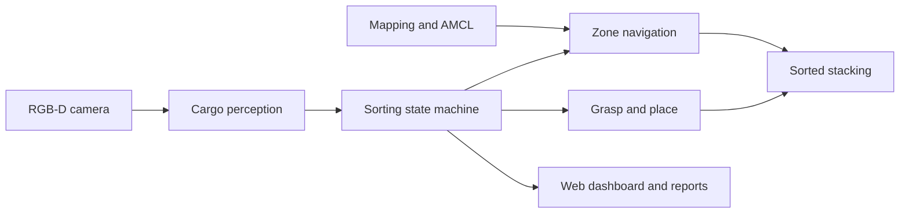
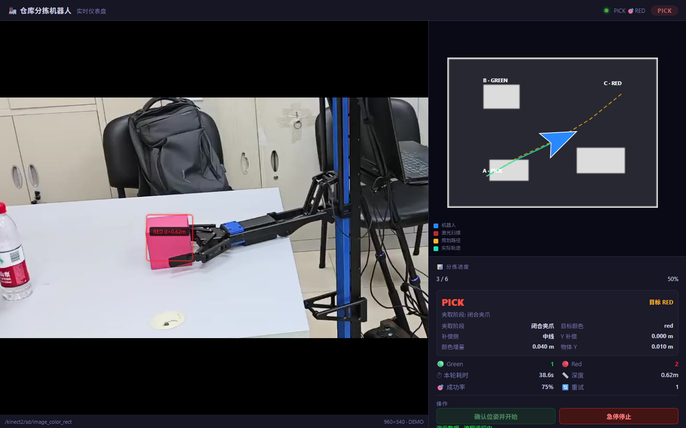

# Warehouse Sorting and Stacking Robot

[English](README.md) | [中文](README.zh-CN.md)

A ROS Noetic integration project for warehouse-style cargo sorting on a WPB Home-compatible mobile manipulator. The project adds RGB-D color perception, task orchestration, field calibration, simulation acceptance, and a browser-based monitoring dashboard around the existing ROS/WPB platform.

The repository contains the project-specific sorting pipeline, Gazebo acceptance scenarios, field calibration tools, real-robot launch files, and the monitoring dashboard. Low-level robot drivers, ROS Navigation/AMCL/GMapping, and the WaterPlus/WPB grasp stack are external platform dependencies rather than reimplemented components.

## Real-Robot Demos

### Pick and transport


The demo shows the integrated WPB grasp behavior approaching the target, closing the gripper, lifting the box, and retaining it while the mobile base moves.

### Mobile-base navigation


## Capabilities

- RGB-D-based colored cargo detection and target selection.
- Integration with the existing WPB grasp action on the current physical-robot path, including result/status monitoring.
- Field tooling for GMapping/AMCL-based localization and A/B/C work-zone calibration.
- Color-based routing to separate drop zones.
- Configurable stack-height bookkeeping and placement logic in the simulation/custom-control path.
- Task state machine with timeouts, retries, and localization fault stops.
- Gazebo acceptance scripts and runtime metrics exported as JSON/CSV/text reports.
- Web dashboard for task state, logs, video streams, and runtime controls.

## System Flow



The repository keeps two execution paths because simulation and the current physical robot use different grasp-control boundaries:

- **Simulation / custom-control path:** `SEARCH -> ALIGN -> APPROACH -> PICK -> DROP`. The project pipeline performs visual centering and short-range approach before executing the pick-and-place sequence.
- **Current real-robot path:** `LOCALIZING -> SEARCH -> PICK -> DROP -> SEARCH/FINISH`. After the project pipeline locks a target color, it delegates fine target approach and grasp execution to the existing WaterPlus/WPB grasp stack (`wpb_home_objects_3d` + `wpb_home_grab_action`). The sorting pipeline resumes after `/wpb_home/grab_result=done` and routes the box to the corresponding work zone.

Therefore, `ALIGN` and `APPROACH` remain part of the generic/simulation state machine, but are bypassed by default in the current real-robot configuration.

## Scope and Verification

**Implemented in this repository:** RGB-D color detection, target selection and sorting orchestration, state/metrics reporting, simulation pick-place logic, field calibration helpers, launch/config integration, acceptance scripts, and the Web dashboard.

**Integrated platform components:** WPB Home hardware drivers, Kinect/RPLIDAR drivers, ROS Navigation, AMCL/GMapping, `wpb_home_objects_3d`, and `wpb_home_grab_action`.

**Demonstrated on the physical robot in the included media:** object pick-and-transport and mobile-base navigation. The repository also contains configurable multi-level placement logic and a six-operation Gazebo acceptance scenario, but the included evidence does **not** claim a fully autonomous multi-layer physical-robot stacking run.

## Repository Layout

```text
.
|-- README.md
|-- README.zh-CN.md
|-- start_dashboard.sh
|-- media/
|   |-- dashboard-preview.png
|   |-- grasping-demo.gif
|   `-- navigation-demo.gif
`-- src/
    |-- CMakeLists.txt
    |-- arm_grab_task/        # Perception, grasping, sorting, simulation, reports, dashboard
    `-- warehouse_tuning/     # Mapping, localization, zone capture, calibration, field tests
```

## Requirements

- Ubuntu 20.04
- ROS Noetic and catkin
- Python 3
- Gazebo for simulation
- OpenCV and `cv_bridge`
- ROS Navigation Stack, AMCL, and GMapping
- WPB Home packages and the appropriate Kinect v2 / RPLIDAR drivers

Hardware vendor packages are not bundled in this repository. Install them in the system ROS environment or in the same catkin workspace before building.

## Build

```bash
git clone https://github.com/lori314/WAREHOUSE_SORTING_ROBOT.git
cd WAREHOUSE_SORTING_ROBOT

source /opt/ros/noetic/setup.bash
rosdep install --from-paths src --ignore-src -r -y
catkin_make
source devel/setup.bash
```

If `rosdep` reports unresolved WPB or device-driver packages, install the vendor-provided packages first and rerun the build.

## Simulation Acceptance

Launch the tabletop sorting scenario:

```bash
roslaunch arm_grab_task stack_sort_abc_tabletop_demo.launch \
  auto_start_pipeline:=true
```

Run the automated acceptance checker in another terminal:

```bash
source devel/setup.bash
rosrun arm_grab_task run_stack_sort_acceptance.py \
  --timeout 900 --settle-seconds 1.5
```

The default scenario checks six pick-and-place operations, per-color completion counts, and Gazebo model-lift criteria after gripper contact. These checks validate the simulation path; they are not evidence of six physical-robot grasps. Reports are written to `/tmp/arm_grab_task_reports/`.

## Real-Robot Workflow

Read the field guides before operating the robot:

- [Quick field guide](src/warehouse_tuning/EASY_START.md)
- [Complete real-robot guide](src/warehouse_tuning/REAL_ROBOT_START_HERE.md)

The normal workflow is:

```bash
# 1. Start the base, lidar, Kinect, and joystick.
# Replace the placeholders with this robot's stable by-id paths.
roslaunch warehouse_tuning field_robot_base.launch \
  core_port:=/dev/serial/by-id/BASE_DEVICE_ID \
  rplidar_port:=/dev/serial/by-id/LIDAR_DEVICE_ID

# 2. Create/load the map and capture zone and cargo parameters.
rosrun warehouse_tuning field_calibration_wizard.py \
  --manage-stack --keep-managed-stack --rviz

# 3. Start the calibrated sorting pipeline.
roslaunch arm_grab_task stack_sort_field.launch rviz:=true
```

In the default real-robot configuration, the project pipeline is responsible for localization, color-based target selection, task state, and B/C routing, while the existing WPB grasp behavior performs the final object approach and grasp sequence. Generated maps, zone poses, camera features, and run reports are local runtime data and are ignored by Git.

## Web Dashboard



The dashboard combines the live camera feed and detection overlay with the occupancy map, robot pose, laser scan, planned and actual paths, task progress, grasp diagnostics, and operator controls.

```bash
./start_dashboard.sh
```

Open `http://ROBOT_IP:8000/dashboard.html` from a computer on the same network. See the [dashboard guide](src/arm_grab_task/web/README.md) for launch modes and ports.

For a ROS-independent interface preview, serve the web directory and open `http://localhost:8000/dashboard.html?demo=1`:

```bash
python3 -m http.server 8000 -d src/arm_grab_task/web
```

## Safety Notes

- Clear the robot's travel and arm workspace before enabling real motion.
- Verify the emergency stop, base direction, gripper travel, and localization quality.
- Start with dry-run or unit-test modes after changing hardware or calibration.
- Do not use the Gazebo-only helper parameters as evidence of a successful physical grasp.

## License

No project-level open-source license is currently provided. Unless separate permission is granted by the rights holders, the repository is intended for study and project demonstration only.
