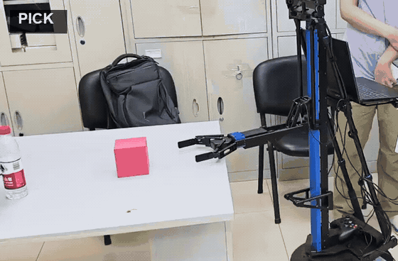
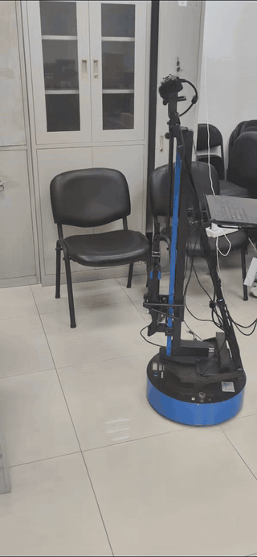
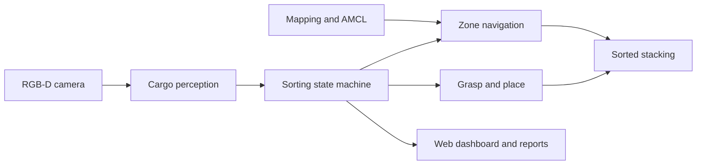

# Warehouse Sorting and Stacking Robot

[English](README.md) | [中文](README.zh-CN.md)

A ROS Noetic project for warehouse-style cargo perception, grasping, navigation, sorting, and multi-layer stacking on a WPB Home-compatible mobile manipulator.

The repository contains the task pipeline, Gazebo acceptance scenarios, field calibration tools, real-robot launch files, and a browser-based monitoring dashboard.

## Real-Robot Demos

### Grasped cargo transfer



### Mobile-base navigation



## Capabilities

- RGB-D-based colored cargo detection and target selection.
- WPB grasp-action integration with lift verification.
- Mapping, AMCL localization, and A/B/C work-zone calibration.
- Color-based routing to separate drop zones.
- Configurable multi-layer stacking positions.
- Task state machine with timeouts, retries, and localization fault stops.
- Gazebo acceptance scripts with JSON and Markdown reports.
- Web dashboard for task state, logs, video streams, and runtime controls.

## System Flow



The main workflow follows `SEARCH -> ALIGN -> APPROACH -> PICK -> DROP`, with localization checks and recovery transitions around the motion stages.

## Repository Layout

```text
.
|-- README.md
|-- README.zh-CN.md
|-- start_dashboard.sh
|-- media/
|   |-- grasping-demo.gif
|   `-- navigation-demo.gif
`-- src/
    |-- CMakeLists.txt
    |-- arm_grab_task/        # Perception, grasping, sorting, simulation, reports, dashboard
    `-- warehouse_tuning/     # Mapping, localization, zone capture, calibration, field tests
```

## Requirements

- Ubuntu 20.04
- ROS Noetic and catkin
- Python 3
- Gazebo for simulation
- OpenCV and `cv_bridge`
- ROS Navigation Stack, AMCL, and GMapping
- WPB Home packages and the appropriate Kinect v2 / RPLIDAR drivers

Hardware vendor packages are not bundled in this repository. Install them in the system ROS environment or in the same catkin workspace before building.

## Build

```bash
git clone https://github.com/lori314/WAREHOUSE_SORTING_ROBOT.git
cd WAREHOUSE_SORTING_ROBOT

source /opt/ros/noetic/setup.bash
rosdep install --from-paths src --ignore-src -r -y
catkin_make
source devel/setup.bash
```

If `rosdep` reports unresolved WPB or device-driver packages, install the vendor-provided packages first and rerun the build.

## Simulation Acceptance

Launch the tabletop sorting scenario:

```bash
roslaunch arm_grab_task stack_sort_abc_tabletop_demo.launch \
  auto_start_pipeline:=true
```

Run the automated acceptance checker in another terminal:

```bash
source devel/setup.bash
rosrun arm_grab_task run_stack_sort_acceptance.py \
  --timeout 900 --settle-seconds 1.5
```

The default scenario checks six pick-and-place operations, per-color completion counts, and physical lift events. Reports are written to `/tmp/arm_grab_task_reports/`.

## Real-Robot Workflow

Read the field guides before operating the robot:

- [Quick field guide](src/warehouse_tuning/EASY_START.md)
- [Complete real-robot guide](src/warehouse_tuning/REAL_ROBOT_START_HERE.md)

The normal workflow is:

```bash
# 1. Start the base, lidar, Kinect, and joystick.
# Replace the placeholders with this robot's stable by-id paths.
roslaunch warehouse_tuning field_robot_base.launch \
  core_port:=/dev/serial/by-id/BASE_DEVICE_ID \
  rplidar_port:=/dev/serial/by-id/LIDAR_DEVICE_ID

# 2. Create/load the map and capture zone and cargo parameters.
rosrun warehouse_tuning field_calibration_wizard.py \
  --manage-stack --keep-managed-stack --rviz

# 3. Start the calibrated sorting pipeline.
roslaunch arm_grab_task stack_sort_field.launch rviz:=true
```

Generated maps, zone poses, camera features, and run reports are local runtime data and are ignored by Git.

## Web Dashboard

```bash
./start_dashboard.sh
```

Open `http://ROBOT_IP:8000/dashboard.html` from a computer on the same network. See the [dashboard guide](src/arm_grab_task/web/README.md) for launch modes and ports.

## Safety Notes

- Clear the robot's travel and arm workspace before enabling real motion.
- Verify the emergency stop, base direction, gripper travel, and localization quality.
- Start with dry-run or unit-test modes after changing hardware or calibration.
- Do not use the Gazebo-only helper parameters as evidence of a successful physical grasp.

## License

No project-level open-source license is currently provided. Unless separate permission is granted by the rights holders, the repository is intended for study and project demonstration only.
