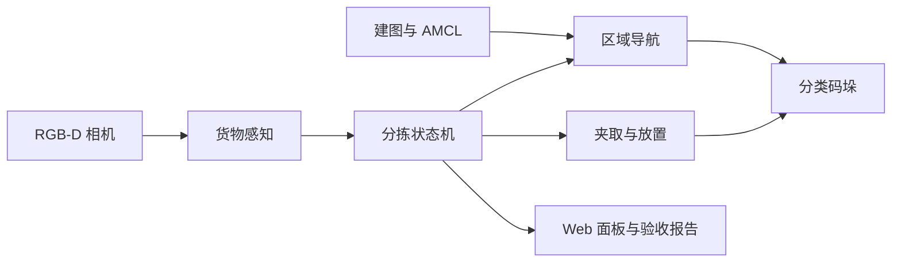

# 仓库货物分拣码垛机器人

[English](README.md) | [中文](README.zh-CN.md)

这是一个基于 ROS Noetic、运行在兼容 WPB Home 移动机械臂平台上的仓库分拣集成项目。项目在现有 ROS/WPB 平台之上实现了 RGB-D 颜色感知、分拣任务编排、现场标定、仿真验收和 Web 监控等功能。

仓库包含项目侧的分拣流水线、Gazebo 验收场景、现场标定工具、真机启动文件和 Web 监控面板。底层机器人驱动、ROS Navigation/AMCL/GMapping，以及 WaterPlus/WPB 抓取链路属于外部平台能力，并非本项目从零实现。

## 真机演示

### 夹取与运输


演示中，机器人通过集成的 WPB 抓取行为完成靠近目标、闭合夹爪与抬升，并在移动底盘运动过程中保持稳定夹持。

### 移动底盘导航


## 主要功能

- 基于 RGB-D 数据的彩色货物检测与目标选择。
- 当前真机路径对接已有 WPB 抓取动作，并监听抓取过程与结果状态。
- 提供基于 GMapping/AMCL 的现场建图、定位与 A/B/C 作业区域标定工具。
- 按颜色将货物送往不同放置区域。
- 在仿真/自定义控制路径中提供可配置的堆叠层高计数与放置逻辑。
- 支持超时、重试和定位故障停车的任务状态机。
- Gazebo 自动验收与运行指标记录，可导出 JSON/CSV/文本报告。
- 用于状态、日志、视频流和运行控制的 Web 面板。

## 系统流程



仓库保留了两套执行路径，因为仿真与当前真机配置对“靠近/抓取”的职责划分不同：

- **仿真 / 自定义控制路径：** `SEARCH -> ALIGN -> APPROACH -> PICK -> DROP`。项目自身的状态机负责视觉居中、短距离靠近以及后续取放流程。
- **当前真机路径：** `LOCALIZING -> SEARCH -> PICK -> DROP -> SEARCH/FINISH`。项目主流程锁定目标颜色后，将精细靠近与抓取动作交给已有的 WaterPlus/WPB 抓取链路（`wpb_home_objects_3d` + `wpb_home_grab_action`）；收到 `/wpb_home/grab_result=done` 后，再由分拣主流程根据颜色导航至对应作业区。

因此，`ALIGN` 与 `APPROACH` 仍属于通用/仿真状态机，但在当前真机默认配置中会被跳过。

## 项目边界与验证范围

**本仓库实现：** RGB-D 颜色检测、目标选择与分拣任务编排、状态与指标记录、仿真取放逻辑、现场标定辅助、launch/config 集成、自动验收脚本和 Web 监控面板。

**集成的外部平台能力：** WPB Home 底层硬件驱动、Kinect/RPLIDAR 驱动、ROS Navigation、AMCL/GMapping、`wpb_home_objects_3d` 和 `wpb_home_grab_action`。

**仓库媒体中已经展示的真机能力：** 物体夹取并运输、移动底盘导航。仓库同时包含多层放置逻辑和 6 次取放的 Gazebo 验收场景，但现有展示材料**不据此声称已经完成真机全自主多层码垛闭环**。

## 仓库结构

```text
.
|-- README.md
|-- README.zh-CN.md
|-- start_dashboard.sh
|-- media/
|   |-- dashboard-preview.png
|   |-- grasping-demo.gif
|   `-- navigation-demo.gif
`-- src/
    |-- CMakeLists.txt
    |-- arm_grab_task/        # 感知、抓取、分拣、仿真、报告与面板
    `-- warehouse_tuning/     # 建图、定位、区域采集和现场标定
```

## 运行环境

- Ubuntu 20.04
- ROS Noetic 与 catkin
- Python 3
- Gazebo（仿真）
- OpenCV 与 `cv_bridge`
- ROS Navigation Stack、AMCL 与 GMapping
- WPB Home 基础包以及对应的 Kinect v2 / RPLIDAR 驱动

本仓库不附带硬件厂商代码。编译前请先将相关包安装到系统 ROS 环境或同一 catkin 工作空间。

## 编译

```bash
git clone https://github.com/lori314/WAREHOUSE_SORTING_ROBOT.git
cd WAREHOUSE_SORTING_ROBOT

source /opt/ros/noetic/setup.bash
rosdep install --from-paths src --ignore-src -r -y
catkin_make
source devel/setup.bash
```

如果 `rosdep` 报告 WPB 或设备驱动依赖无法解析，请先安装厂商提供的 ROS 包。

## 仿真验收

启动桌面分拣场景：

```bash
roslaunch arm_grab_task stack_sort_abc_tabletop_demo.launch \
  auto_start_pipeline:=true
```

在另一个终端运行验收脚本：

```bash
source devel/setup.bash
rosrun arm_grab_task run_stack_sort_acceptance.py \
  --timeout 900 --settle-seconds 1.5
```

默认场景会检查 6 次取放、各颜色完成数量，以及夹爪接触后的 Gazebo 模型抬升判据。这些结果用于验证仿真路径，并不等同于完成 6 次真机抓取。报告保存在 `/tmp/arm_grab_task_reports/`。

## 真机运行

操作前请先阅读：

- [现场快速指南](src/warehouse_tuning/EASY_START.md)
- [完整真机指南](src/warehouse_tuning/REAL_ROBOT_START_HERE.md)

常规流程：

```bash
# 1. 启动底盘、雷达、Kinect 和手柄。
# 将占位符替换为当前机器人的稳定 by-id 路径。
roslaunch warehouse_tuning field_robot_base.launch \
  core_port:=/dev/serial/by-id/BASE_DEVICE_ID \
  rplidar_port:=/dev/serial/by-id/LIDAR_DEVICE_ID

# 2. 新建/加载地图，并采集区域和货物参数。
rosrun warehouse_tuning field_calibration_wizard.py \
  --manage-stack --keep-managed-stack --rviz

# 3. 启动已标定的分拣流程。
roslaunch arm_grab_task stack_sort_field.launch rviz:=true
```

在当前默认真机配置中，项目主流程负责定位、基于颜色的目标选择、任务状态管理以及 B/C 区分流；最终的目标精细靠近和抓取动作由已有 WPB 抓取行为完成。地图、区域位姿、相机特征和运行报告都属于本地运行数据，已由 Git 忽略。

## Web 监控面板


面板集中展示实时相机与检测框、占用栅格地图、机器人位姿、激光扫描、规划与实际路径、任务进度、夹取诊断和操作控制。

```bash
./start_dashboard.sh
```

在同一网络的电脑上访问 `http://ROBOT_IP:8000/dashboard.html`。启动模式和端口说明见 [面板指南](src/arm_grab_task/web/README.md)。

如需在没有 ROS 的环境中预览界面，可启动静态服务后访问 `http://localhost:8000/dashboard.html?demo=1`：

```bash
python3 -m http.server 8000 -d src/arm_grab_task/web
```

## 安全提示

- 启用真实运动前，清空底盘和机械臂的工作空间。
- 检查急停、底盘方向、夹爪行程和定位质量。
- 更换硬件或标定参数后，先从 dry-run 或单元测试开始。
- Gazebo 专用辅助参数不能用于证明真机抓取成功。

## 许可说明

本仓库当前没有项目级开源许可证。未获得权利人单独授权时，仓库仅用于学习交流和项目展示。
